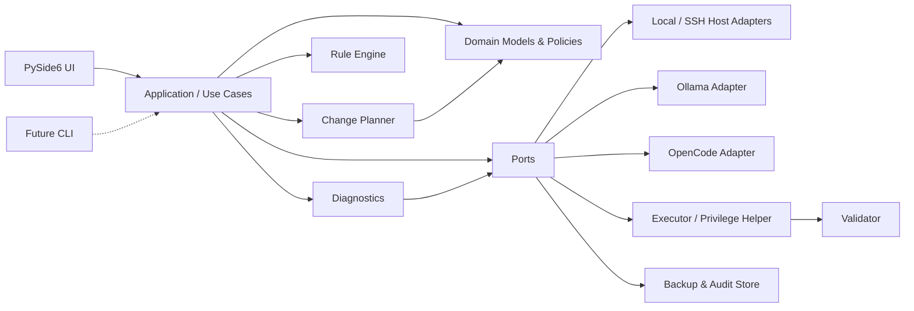

# アーキテクチャ設計

## 1. 方針

Hexagonal Architecture を簡略化して採用する。domain と application を中心に置き、PySide6、subprocess、OpenSSH、HTTP、filesystem、PolicyKit は外側の Adapter とする。これにより CLI や将来の Rust/Tauri フロントエンドは同じユースケース契約を利用できる。



依存は外側から内側へのみ許可する。domain は PySide6、OS、JSON/YAML ライブラリ、subprocess を import しない。

## 2. レイヤとモジュール

```text
src/llm_manager/
├── ui/               presenters, view-models, windows, workers
├── application/      diagnose/recommend/plan/apply/rollback use cases, ports
├── domain/           immutable models, enums, errors, state machines
├── diagnostics/      probes, normalization, report assembly
├── optimization/     profiles, rule engine, rule catalog
├── planning/         recommendation-to-change translation, conflicts, diff
├── adapters/
│   ├── host/          local, openssh
│   ├── ollama/        CLI/API/systemd integration
│   ├── clients/       OpenCode now; future client adapters
│   └── system/        Linux, NVIDIA, AMD probes
└── infrastructure/   process runner, HTTP, files, backup, audit, privilege
```

`ui/i18n/`にQt translation catalog、locale resolver、表示formatterを置く。application/domainは翻訳済み文章ではなく安定したmessage key、enum、typed parametersを返し、UI境界で翻訳する。Ruleの理由も`reason_key + reason_args`を保持し、監査ログにはkeyと構造化値を記録する。

| 部分 | 責務 | 禁止事項 |
|---|---|---|
| UI | 入力、表示、承認、進捗、キャンセル要求 | subprocess/SSH/設定編集を直接実行しない |
| Application | ワークフロー、トランザクション境界、port 呼出、状態遷移 | OS 固有実装を持たない |
| Domain | モデル、不変条件、状態、ポリシー | I/O とフレームワーク依存を持たない |
| Diagnostics | probe 選択、構造化、整合性判定 | 設定を書き換えない |
| Optimization | profile と rule の評価 | 変更を実行しない、LLM を呼ばない |
| Planning | 推奨を具体的 ChangeSet に変換、競合検出 | 承認や実行を代行しない |
| Adapters | 外部仕様と port の変換 | 生出力を domain に漏らさない |
| Infrastructure | プロセス、転送、権限、保存 | ビジネス判断を行わない |

## 3. 主要 Port

- `HostPort`: capability 探索、構造化コマンド実行、ファイル stat/read/stage/replace、サービス状態。
- `OllamaPort`: installation/version/config/service/API/model/runtime の照会と検証。
- `ClientAdapter`: `inspect()`, `plan_changes()`, `validate()`。MVP 実装は OpenCode。
- `RuleCatalogPort`: ルール版と有効ルールを提供。
- `BackupStorePort`: manifest、content、integrity、retention。
- `PrivilegePort`: 承認済み特権操作だけを実行。
- `AuditPort`: 秘密情報を除外したイベント保存。

Port の戻り値は `CommandResult`、`ProbeResult[T]` などの構造体とし、生の stdout 判定を application に置かない。

### 最小メソッド契約

| Port | MVP の操作 | 契約上の要点 |
|---|---|---|
| `HostPort` | `capabilities`, `execute_readonly`, `stat`, `read_file`, `stage_file`, `atomic_replace`, `service_status` | 書込操作は read-only runner と別メソッドにし、precondition hash を必須とする |
| `OllamaPort` | `inspect`, `list_models`, `list_loaded_models`, `validate_api`, `plan_setting_changes` | 対応 version と取得 source を結果に含める |
| `ClientAdapter` | `inspect`, `plan_changes`, `validate` | 未知 schema では変更計画を返さず read-only に縮退する |
| `BackupStorePort` | `create`, `verify`, `restore`, `list_manifests` | incomplete/invalid manifest から Apply/restore しない |
| `PrivilegePort` | `capabilities`, `execute_declared_changes` | 任意コマンドを受け取らず、許可 target と before hash を検証する |

全操作は timeout/cancellation token と correlation ID を受け取れる契約にする。境界の型検証失敗は domain exception ではなく構造化 Adapter error に変換する。

## 4. Local / SSH Host Adapter

`LocalHostAdapter` と `OpenSshHostAdapter` は同じ `HostPort` を実装する。Local は argv 配列で直接実行する。SSH は system `ssh` と OpenSSH alias を利用し、設定、agent、ProxyJump、known_hosts を OpenSSH に委譲する。

SSH のリモートコマンドは、安全な固定 runner を介して引数を符号化し、任意の shell 文字列連結を避ける。ファイル更新は、ユーザー領域では stage + hash verify + atomic replace、特権領域では限定 helper/sudo を用いる。能力差は `HostCapabilities` で表現する。

SSHの対話sudoは、GUI内にpassword promptを実装せず、外部端末上の`ssh -t`から限定remote helperを起動する。承認済みrequestとoperation journalを境界にし、passwordless sudoでも対話sudoでも同じhelper protocolを利用する。sudo認証cacheを別SSH sessionで共有できるとは仮定しない。

## 5. Ollama Adapter

systemd/CLI/API/config の複数ソースを担当する。

- CLI: 導入、version、モデル一覧の補助
- systemd: unit、active state、有効な environment/drop-in
- HTTP API: connectivity、tags、running models、runtime metadata
- config: 永続設定の期待値

各値に source と observed_at を付け、設定値と runtime 値を別フィールドとして保持する。不一致は Adapter で隠さず `ObservedSetting` として Diagnostics に返す。

## 6. OpenCode Adapter

OpenCode は `ClientAdapter` の最初の実装とする。version ごとの設定 schema と探索順序を Adapter 内に閉じ込め、provider/model/base URL/context/timeout を正規化する。未知フィールドを保持した構文保存型編集を行い、全ファイル再生成を避ける。

将来の Codex/Claude Code/OpenClaw は同じ契約を実装するが、設定名を無理に共通化せず、共通 capability と製品固有 detail を併用する。

## 7. Rule Engine と Change Planner

Rule Engine は `DiagnosticReport + OptimizationProfile + RuleCatalogVersion` を入力し、`Recommendation[]` を返す純粋処理である。ルールの条件、優先順位、競合解決、適用不能理由をテストできる。

Change Planner は採用された推奨を Adapter の設定 schema に照合し、具体的なファイル/API/service 操作へ変換する。重複、競合、root/restart の集約、事前条件、逆操作、unified diff を生成する。Rule Engine はファイルパスや shell command を生成しない。

## 8. Executor、Validator、Backup / Rollback

Executor は状態機械 `DRAFT → REVIEWED → APPROVED → BACKED_UP → APPLYING → VALIDATING → COMMITTED` を守る。失敗時は `ROLLING_BACK → ROLLED_BACK`、復元も失敗した場合は `RECOVERY_REQUIRED` とする。

Validator は次の順で検証する。

1. 設定 parse と期待値
2. 対象ファイル metadata/hash
3. 必要な service 状態
4. Ollama API connectivity と runtime 反映
5. OpenCode 接続設定の軽量確認（推論実行は MVP 必須にしない）

Backup Store は対象ごとの元内容、存在有無、mode/owner、hash、host fingerprint、時刻、plan IDをmanifestに保存する。SSH対象ではlocal正本とremote復旧用copyの両方を作り、双方のintegrity確認をApplyの前提とする。秘密を含み得るためuser/root-only permissions、ログ非表示、保持期限を設ける。

詳細は [safe-apply.md](safe-apply.md) を参照する。

## 9. GUI との依存関係と並行処理

UI は application service の非同期 facade だけを呼ぶ。MVP は Qt event loop と統合しやすい `QThreadPool + QRunnable` を採用し、タスクごとに progress/result/error/cancelled signal を返す。UI object を worker から操作しない。詳細は [gui.md](gui.md) を参照する。

## 10. エラーとキャンセル

エラーは `Unsupported`, `NotInstalled`, `PermissionDenied`, `AuthenticationFailed`, `Timeout`, `CommandFailed`, `ParseFailed`, `Conflict`, `ValidationFailed`, `RollbackFailed` に正規化する。外部 stderr は秘密を除外した診断 detail として保持する。

キャンセルは協調的に行う。診断は probe 境界で停止可能、Apply は原子的ステップの途中で中断せず、安全点で中止または rollback する。

## 11. 将来拡張

- CLI は application 層を直接利用する。
- 他 client は `ClientAdapter`、llama.cpp/vLLM は runtime adapter を追加する。
- 複数ホストは単一ホスト use case の上に orchestration 層を追加する。
- Rust/Tauri 移行時は domain schema と use-case protocol を JSON Schema 等で固定し、Python core を service/CLI 境界で段階的に置換できる。

## 12. 設計判断と代替案

- **採用:** Paramiko ではなく OpenSSH CLI。既存設定との整合が高い。将来、厳密なストリーム API が必要なら libssh 系を再評価する。
- **採用:** 同期 port + worker thread。asyncio 全面採用は Qt 統合とキャンセル設計が複雑なため見送る。
- **採用:** core と Adapter の同一プロセス構成。特権操作だけ別 helper とする。全面 daemon 化は複数ホスト管理が必要になった時点で検討する。

## 13. 依存規則の検証

- `domain` は他のプロジェクト内パッケージへ依存しない。
- `application` は `domain` と抽象 Port のみに依存する。
- `diagnostics/optimization/planning` は UI と concrete Adapter を import しない。
- `ui` は application facade と表示用 DTO だけを参照する。
- Adapter 間連携は application を介し、Ollama Adapter が PySide6 や OpenCode Adapterを直接参照しない。

これらを import-linter 相当の静的検査と architecture test で CI に固定する。具体的なツール採用は project scaffold 時に決定する。

## 14. Locale境界

- 起動時にQt/OS localeを解決し、`ja* → ja`, `en* → en`, その他 → `en`とする。
- ユーザー設定による明示言語をOS localeより優先し、次回起動にも保持する。
- 数値、日時、容量は表示時にlocale対応formatを使うが、永続化・diff・API・監査値はlocale非依存形式を使う。
- 外部commandのparserは表示localeに依存せず、機械可読形式または固定localeを利用する。
- 翻訳欠落は英語文字列へ項目単位でfallbackし、空欄やtranslation keyそのものを安全画面に表示しない。
