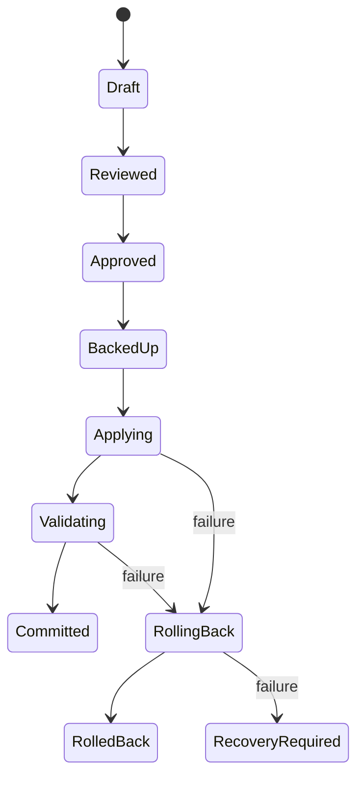

# データモデル設計

## 1. 共通方針

domain model は原則 immutable な dataclass（または同等の値オブジェクト）とし、JSON 化可能な primitive、enum、日時、識別子で構成する。単位はフィールド名に含めるか型で固定し、bytes、MiB、milliseconds を混在させない。各診断値は出所と鮮度を追跡できる。

共通型:

- `ProbeResult[T]`: `status`, `value`, `source`, `observed_at`, `duration_ms`, `warnings`, `error`
- `CommandResult`: `argv_redacted`, `exit_code`, `stdout`, `stderr_redacted`, `timed_out`, `duration_ms`
- `ObservedSetting[T]`: `configured`, `runtime`, `effective`, `sources`, `consistency`
- `SecretValue`: 表示・serialize 時に既定で mask される値
- `LocalizedMessage`: `message_key`, `arguments`, `fallback_text`。domain/applicationからUIへ渡すlocale非依存メッセージ

## 2. 診断モデル

| モデル | 責務 | 主要フィールド |
|---|---|---|
| `HostCapabilities` | Host Adapter が安全に提供できる能力 | `can_execute`, `can_read_files`, `can_stage_files`, `can_elevate`, `service_manager`, `gpu_tools`, `limitations` |
| `HostInfo` | 対象の識別と接続能力 | `host_id`, `kind(local/ssh)`, `display_name`, `ssh_alias`, `hostname`, `user`, `fingerprint`, `capabilities`, `observed_at` |
| `SystemInfo` | OS と資源概要 | `distribution`, `distribution_version`, `kernel`, `architecture`, `uptime_s`, `disk_filesystems`, `environment_hints` |
| `HardwareInfo` | CPU/memory/GPU 集約 | `cpu`, `logical_cores`, `physical_cores`, `ram_total_bytes`, `ram_available_bytes`, `swap_total_bytes`, `swap_free_bytes`, `gpus` |
| `GPUInfo` | GPU 単位の能力と状態 | `id`, `vendor`, `name`, `vram_total_bytes`, `vram_used_bytes`, `utilization_pct`, `temperature_c`, `driver_version`, `compute_stack`, `compute_version`, `compute_architecture`, `visibility` |
| `OllamaInfo` | Ollama 全体の静的・実行時状態 | `installed`, `version`, `binary_path`, `service`, `systemd_unit`, `environment`, `api_endpoint`, `api_connectivity`, `models`, `loaded_models`, `settings` |
| `OllamaModelInfo` | モデルの保存/runtime 情報 | `name`, `digest`, `size_bytes`, `architecture`, `parameters`, `quantization`, `configured_context`, `runtime_context`, `loaded`, `processor`, `cpu_memory_bytes`, `gpu_memory_bytes`, `expires_at` |
| `OpenCodeInfo` | OpenCode と接続設定 | `installed`, `version`, `binary_path`, `config_locations`, `active_config`, `provider`, `model`, `base_url`, `available_providers`, `available_models`, `base_urls`, `context_settings`, `timeout_settings`, `ollama_compatible`, `parse_warnings` |
| `DiagnosticFinding` | 複数ソースの不一致・警告 | `finding_id`, `category`, `severity`, `summary`, `evidence`, `possible_causes`, `affected_fields` |
| `DiagnosticReport` | 一回の診断スナップショット | `report_id`, `schema_version`, `host`, `system`, `hardware`, `ollama`, `opencode`, `probe_results`, `inconsistencies`, `started_at`, `completed_at`, `status` |

`service` は unit 名、load/active/sub state、enabled、取得元を持つ。`disk_filesystems` は mount point、容量、空き、filesystem を持つ。API endpoint や provider credential は秘密値として扱う。

## 3. 最適化モデル

| モデル | 責務 | 主要フィールド |
|---|---|---|
| `OptimizationProfile` | 用途と重視点 | `profile_id`, `version`, `name`, `goals`, `constraints`, `default_weights` |
| `Recommendation` | ルールの評価結果 | `recommendation_id`, `rule_id`, `rule_version`, `target`, `setting_key`, `current_value`, `recommended_value`, `reason_message`, `severity`, `confidence`, `impact_message`, `risk`, `requires_restart`, `requires_root`, `evidence`, `applicability`, `conflicts_with` |
| `OptimizationPlan` | 推奨選択と計画の追跡 | `plan_id`, `report_id`, `report_hash`, `profile`, `rule_catalog_version`, `recommendations`, `selected_ids`, `change_set`, `status`, `created_at`, `expires_at` |

`severity` は `info/low/medium/high/critical`、`confidence` は `low/medium/high` と根拠を持つ。MVP では擬似的な小数精度を避ける。`risk` は `level`, `description`, `mitigations` の複合値とする。

`reason_message`, `impact_message`, riskの説明は`LocalizedMessage`とし、永続化したRecommendationを後から別localeで表示できるよう、翻訳済み文字列だけを保存しない。

## 4. 変更・検証モデル

| モデル | 責務 | 主要フィールド |
|---|---|---|
| `Change` | 1 つの原子的変更 | `change_id`, `target`, `operation`, `before`, `after`, `before_hash`, `diff`, `requires_root`, `requires_restart`, `rollback_operation`, `validation_checks`, `source_span`, `replacement_text` |
| `ChangeSet` | 順序付き変更の単位 | `change_set_id`, `host_id`, `changes`, `dependencies`, `affected_services`, `aggregate_diff`, `risk_summary`, `content_hash`, `status` |
| `ApprovalRecord` | Review した内容への明示承認 | `approval_id`, `plan_id`, `report_hash`, `change_set_hash`, `backup_policy_hash`, `plaintext_backup_acknowledged`, `approved_at`, `actor`, `expires_at` |
| `ValidationResult` | 検証 1 件または集約 | `validation_id`, `scope`, `check`, `expected`, `actual`, `status`, `severity`, `message`, `duration_ms`, `children` |
| `BackupManifest` | 復元に必要な不変記録 | `backup_id`, `plan_id`, `change_set_hash`, `host_id`, `host_fingerprint`, `created_at`, `items`, `manifest_hash`, `storage_location`, `encryption`, `key_scope`, `protected`, `retention_expires_at`, `status` |
| `BackupItem` | 対象単位の復元情報 | `target`, `existed`, `content_ref`, `sha256`, `mode`, `uid`, `gid`, `selinux_context`, `service_state`, `storage_location` |

remote backup の保管位置は各 `BackupItem` に明記する。`actor` はOSユーザー等の監査識別子であり、認証秘密を含めない。

`encryption`は`enabled`, `scheme`, `envelope_version`, `key_reference`を持ち、鍵そのものをmanifestへ保存しない。`key_scope`は`local_secret_service`または`remote_root`で、copyごとに独立鍵を示す。`protected=true`はユーザーが自動削除対象外に指定したことを表す。暗号化無効でもmanifest/contentのintegrity hashは必須とする。

## 5. 状態モデル

承認は `ApprovalRecord` とし、UI のチェック状態だけで表現しない。承認期限切れ、report/plan/change set hash の変更、host identity の変更で失効する。`Committed` は永続化成功ではなく、変更後検証が成功した意味とする。

## 6. 不変条件

- `DiagnosticReport` は完成後に変更しない。
- Recommendation は report/profile/rule version を追跡可能である。
- Change の `before` と Apply 直前の観測値が一致しなければ実行しない。
- ChangeSet の依存順序は循環しない。
- root が必要な Change は特権経路なしに実行しない。
- BackupManifest が complete かつ integrity 検証済みでなければ Apply しない。
- ValidationResult が required check をすべて pass しなければ Commit しない。

## 7. Schema versioning

永続化する report、plan、backup manifest、audit event は `schema_version` を持つ。未知の major version は読み込みを拒否し、minor version は未知フィールドを保持または無視できるようにする。ルール版とアプリ版は別に管理する。

## 8. 未決事項

- dataclasses 単体か、境界検証に Pydantic を採用するか。core の依存を抑えるため dataclasses を初期案とし、外部 JSON 境界だけ schema validator を検討する。
- `bytes` と human-readable 表示の丸め規則、host fingerprint の生成規則、保存形式（JSON/SQLite）は実装前 ADR で固定する。
