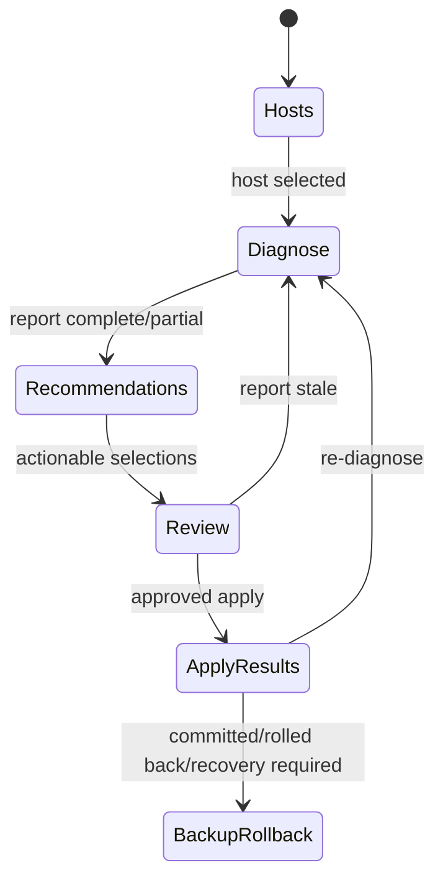

# GUI 設計

## 1. UX 方針

GUI は「観測」と「変更」を明確に分ける。診断や推奨表示から自動的に Apply へ進まず、Review と明示承認を必須にする。技術詳細は段階表示し、risk、権限、再起動、失敗状態は常に見えるようにする。

## 2. 画面構成

MVP は左側の工程ナビゲーションまたは stepper で次を提供する。

1. **Hosts**: Local と `~/.ssh/config` alias の一覧、対象選択、接続能力。秘密鍵の登録 UI は置かない。
2. **Diagnose**: system/hardware/Ollama/OpenCode の進捗、部分結果、警告、再診断。
3. **Recommendations**: profile 選択、推奨カード、evidence、confidence、impact/risk、採否。
4. **Review Changes**: 対象別 diff、現在/変更後、restart/root、依存、総合リスク、承認。
5. **Apply / Results**: Backup/Apply/Validate/Rollback の進捗と終端状態。Apply 開始後は安全なキャンセル規則を表示。
6. **Backup / Rollback**: manifest 一覧、整合性、対象 host、作成日時、手動 rollback の review。

SSH先のroot変更では、Review後に「端末でsudo認証」操作を表示する。起動された外部端末でユーザーが認証し、GUIは`認証待ち / helper実行中 / 結果取得中 / 取消 / 失敗`だけを表示する。パスワード入力欄はGUI内に設けない。

端末起動はPtyxis、GNOME Terminal、およびDebian環境で利用可能な対応端末を能力検出する。対応端末を起動できない場合は、copy可能な期限付きhelper実行commandと注意事項を表示し、ユーザーが任意の端末で手動実行できるfallbackを提供する。commandへpassword、token、設定内容を埋め込まない。

Backup画面ではlocal/remote両copy、暗号化状態、平文時の警告、期限、世代、保護状態、integrityを表示する。暗号化設定の変更はChangeSetのReview対象とし、平文保存を選択した場合は保存先とriskをApply前に再確認する。

Hosts と Diagnose は dashboard として統合可能だが、対象 host が常に header に表示されることを条件とする。

## 3. 主な画面状態

- `idle`, `running`, `partial`, `success`, `failed`, `cancel_requested`
- Review は `stale_report`, `conflict`, `root_unavailable`, `restart_required` を明示
- Apply は domain の transaction state をそのまま表示し、単なる progress percent だけにしない
- `RECOVERY_REQUIRED` は通常エラーと区別し、backup location と復旧 action を固定表示する

値がない場合、空欄にせず `未導入`, `未対応`, `取得不能`, `権限不足` を区別する。

host変更、再診断、rule catalog変更、ChangeSet変更ではReviewの承認を破棄する。Apply中はhost/profile/navigation変更を無効にし、結果画面と安全なキャンセル要求だけを許可する。

## 4. 非同期方式の比較

| 方式 | 長所 | 短所 | MVP 判断 |
|---|---|---|---|
| `QThread` | 長寿命 worker、signal/slot が明快 | task ごとの thread 管理が冗長 | 特権 helper 監視など長寿命処理で必要時使用 |
| `QThreadPool/QRunnable` | 短い独立 task、同時数制限、Qt 統合が容易 | event loop が必要な worker には不向き | **採用** |
| `asyncio` | SSH/HTTP の高並行 I/O に適する | Qt loop 統合、library 混在、cancel が複雑 | MVP の全面採用はしない |

MVP は同期的な application port を `QThreadPool` 上で実行する。1 つの workflow coordinator が signal を発行し、UI thread だけが widget/model を更新する。将来、多数ホストを扱う場合は qasync 等を再評価する。

## 5. Worker 契約

- 入力は immutable request、出力は domain result。
- signal は `started`, `progress(stage, completed, total, message)`, `result`, `error`, `cancelled`。
- exception を UI thread に投げず、構造化 error に変換する。
- worker は QObject/widget への参照を保持しない。
- host ごとの同時操作を lock し、Apply と Diagnose の競合を防ぐ。

## 6. キャンセル

診断は現在の probe が終わるか timeout した安全点で停止する。Plan は純粋処理なので即時停止可能にする。Apply 中は「キャンセル要求」を受け付けるが、ファイル置換や rollback の原子的ステップを中断しない。安全点で rollback して終了するか、既に Validate 中なら結果を確定してから終了する。

ウィンドウ終了時、idle以外のworkflowがあれば状態と影響を表示する。診断はキャンセル後に終了できる。Apply/Validate/Rollback中はworkerを強制終了せず、安全点または明確な終端まで待つ選択を既定とする。OSによる強制終了後も、次回起動時に未完了operation journalを検出して状態照合へ誘導する。

## 7. Review UI の必須表示

- host identity と report の時刻
- 対象ファイル・unit
- 現在値 / 推奨値 / mask 済み unified diff
- 推奨理由と evidence
- severity / confidence / impact / risk
- root と service restart の要否
- backup 予定場所・保持方針
- 選択変更の依存関係と総合結果

承認 checkbox は内容を最後までスクロールしたことの代用にしない。plan hash が変われば承認状態を自動解除する。

## 8. エラー表示

利用者向け summary、影響、次の安全な action、展開可能な技術 detail を分ける。stderr 全文や秘密値は表示しない。copy action も redacted text のみにする。

## 9. Accessibility と操作性

色だけで severity を伝えず icon/text を併用する。keyboard navigation、focus order、拡大表示、長い path/diff の選択可能表示を考慮する。破壊性のある Apply/Rollback は通常 navigation と視覚的に区別する。

## 10. 言語とLocale

- 対応言語は日本語と英語。初回はユーザーlocale、明示設定後はその設定を優先する。
- 設定画面から言語を選択できる。可能なUIは即時更新し、再起動が必要な箇所があれば明示する。
- 未対応localeは英語へfallbackする。翻訳欠落も項目単位で英語へfallbackする。
- 翻訳catalogのkeyをwidget IDやdomain判定に流用しない。
- 日本語・英語の文字長差でdiff、警告、ボタン、進捗が欠落しないlayoutをtestする。
- 技術detailでは原文のredacted stderrを表示可能とするが、要約、影響、次のactionは選択言語で表示する。

## 11. GUI テスト

- presenter/view-model は headless unit test
- fake use case による state transition test
- Qt test で UI thread 非 blocking、signal、cancel、二重実行防止
- screenshot/golden は補助とし、文言と accessible name を assertion する
- Apply の承認失効、stale plan、rollback/RECOVERY_REQUIRED を必須 scenario とする
- `ja`, `en`, 未対応localeのfallback、翻訳key完全性、長文layoutを検証する

UI非blockingの受け入れテストでは、fake workerが長時間処理中でもQt event loopのsentinel eventが継続処理されることを測定する。CI環境差を考慮し、絶対時間だけでなく「worker処理をUI threadで実行していないこと」と「進捗・cancel signalが処理されること」を必須判定にする。製品版の具体的な応答時間上限は対応ハードウェア基準とともにrelease checklistで固定する。

## 12. 未決事項

PySide6 6.8.6のwheel/plugin、具体的なnavigation widget、diff viewer、Ptyxis/GNOME Terminal以外に正式対応するterminal emulator、アクセシビリティ対象基準、ログ/backup画面の情報量を実装前にwireframeで確認する。credentialは保存しない。Secret Serviceはbackup暗号鍵だけに利用する。
