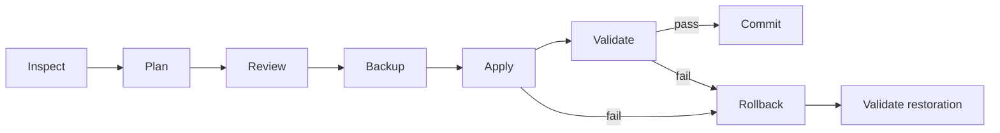

# 安全な設定変更設計

## 1. 基本ワークフロー

各段階は監査イベントと状態を持つ。`Commit` は変更後検証に成功したことを表し、Git commit や OS transaction を意味しない。

## 2. Inspect

最新の DiagnosticReport に加え、変更対象ファイルの内容、存在、sha256、mode、owner、service state、effective environment を取得する。秘密値は UI/log では mask するが、復元に必要な元内容は保護された Backup Store に保存できる。

## 3. Plan

Change Planner は選択された Recommendation を具体的な `Change[]` に変換する。

- 対象ファイルまたは systemd unit/drop-in
- 現在値と変更後値
- unified diff（秘密値 mask 版）
- parse/schema validation
- root、restart、影響、risk
- Apply 前提条件と期待 hash
- 実行順序、検証、rollback action

未知 schema、編集で失われるコメント、競合設定、復元不能な操作は自動変更対象にしない。

root Changeを含むPlanは、同じDiagnosticReportで互換helperのread-only検査が成功し`host.capabilities.can_elevate=true`になっている場合だけ生成する。helper状態が変わった場合はApply境界でもrequest/固定path/owner/modeを再検査するため、Plan時のcapabilityだけを権限根拠にはしない。

MVPの自動変更対象ファイルは1 item 16 MiB以下に限定する。上限超過は通常の設定ファイルとして異常とみなしread-onlyにする。これによりitem単位のAESGCM one-shot処理に上限を設ける。

## 4. Review と承認

UI は対象、現在値、推奨値、diff、再起動、root、影響、risk を全て表示する。ユーザーは change 単位で選択できるが、依存 change を外した不整合 plan は作れない。

承認時に `plan_id + report_hash + change_set_hash` を記録する。Plan 内容が変わった場合、承認は失効する。Apply は独立した明示操作とし、推奨画面の選択だけを承認とみなさない。

## 5. Backup

- Apply 前に全対象の backup が成功することを必須とする。
- 存在しなかったファイルも `existed=false` と記録する。
- content、hash、mode、uid/gid、可能なら SELinux context、service state を保存する。
- manifest 自体にも integrity hash を付ける。
- Local対象でもSSH対象でも、local user-only Backup Storeを正本として作成する。
- SSH対象は、local正本に加えてSSH先にも復旧用copyとmanifestを残す。root所有設定を含むcopyはremote helperが専用のroot-only領域へ保存し、一般ユーザー設定は専用user-only領域へ保存する。
- Applyはlocal正本とremote復旧用copyの両方について、内容hashとmanifest integrityの検証が成功した場合だけ開始する。一方しか作成できない場合は安全性を下げて続行せず中止する。
- 二重保存は媒体・接続障害への冗長性を高めるが、remote host自体のdisk障害から守るのはlocal正本である。remote copyをlocalより安全と一律には扱わない。

backup に秘密が含まれる可能性を前提に、一覧やログで内容を表示しない。保持期間と削除 UX は明示する。

### 保持と暗号化

- 既定保持は30日かつhostごとに直近10世代とする。いずれかの上限を超えた未保護backupを古い順に削除候補とする。
- rollback可能性を失わないよう、対象hostに復元可能なbackupが他にない場合は最後の1件を自動削除しない。
- ユーザーが`protected`にしたbackupは自動削除しない。保護解除と手動削除は対象、local/remote copy、復元不能riskをReviewしてから行う。
- 暗号化はBackup設定で選択可能にする。選択状態はPlan/Review/manifestに記録し、Apply直前に変更された場合は承認を失効させる。
- 一般配布buildでは暗号化ON、明示された開発モードではOFFを初期値とする。build種別は初期値だけを決め、既存ユーザー設定を上書きしない。
- 暗号化無効時は、設定の秘密情報が平文でlocal/remoteへ保存され得ることを明示し、ユーザーの確認を必要とする。権限制限とintegrity検証は暗号化の有無にかかわらず必須である。
- 暗号化有効時の鍵はbackupやmanifestと同じ場所へ保存しない。localはSecret Service参照、remoteは分離したroot-only key storeを使う。
- local copyはSecret Serviceのlocal master key、remote copyはSSH先root-only keyを使い、同じplaintextを別々に暗号化する。local PC喪失時もremote helperでremote copyを単独復元できる。
- AES-256-GCMをitem単位で使用し、12-byte random nonceを再利用しない。AADへenvelope version、backup ID、host fingerprint、target identifierを束縛する。

## 6. Apply

1. host identity/fingerprint と接続先を再確認する。
2. 対象の現在 hash/metadata が Plan の前提条件と一致するか確認する。
3. 新内容を同一 filesystem の一時ファイルへ書き、parse/schema、mode を検証する。
4. fsync 後に atomic rename する。atomicity が保証できない場合はリスク表示し、MVP の自動変更対象から外すことを優先する。
5. 必要な全ファイル変更後に、必要な service だけを所定順で restart/reload する。

特権操作は署名ではなく内容 hash で固定した宣言的 request を限定 helper に渡す。helper は許可 path、operation、before hash を再検証する。任意 argv や shell command は受け取らない。local root workflowではbackup manifestへ`change_set_hash`を保存し、helper requestとoperation journalへapproval ID、backup ID、manifest hash、request hashを束縛する。root helper receiptは同じoperation IDとrequest hashを保持するため、別Plan・別backup・別requestの結果を成功として受理しない。

### MVP変更allowlist

自動変更は、対応version matrixで保存場所、schema、優先順位、検証方法、rollback方法が確認済みの次の分類だけを候補とする。

| 分類 | 許可条件 | 既定動作 |
|---|---|---|
| OpenCode provider/model/base URL | active config と schema が一意に解決できる | user-owned config のみ。秘密値は変更しない |
| OpenCode context/compaction/timeout | 対応versionで正式キーと型を確認済み | unknown/deprecated key は read-only |
| Ollama service environment | 対応する systemd unit/drop-in と有効優先順位が判明 | 専用drop-inだけを対象とし restart を明示 |
| Ollama endpoint/context関連設定 | 設定値とruntime検証の対応が確認済み | 反映をAPIで検証できない場合はread-only |

具体的なファイルパスとキーは version matrix で固定し、任意パス、credential、SSH設定、既存unit本体、package管理領域はallowlistに含めない。allowlist未登録のRecommendationは説明表示のみで、Changeを生成しない。

### 特権helper要求

helper request は `protocol_version`, `host_id`, `plan_id`, `change_set_hash`, `operations[]`, `requested_at`, `expires_at` を持つ。各operationは固定enum、正規化済み対象パス、before hash、staged content hash、期待metadataだけを含む。helperは次を拒否する。

- allowlist外またはsymlink解決後に許可root外となるpath
- 期限切れ、hash不一致、未知operation/protocol
- world-writable staging、所有者不一致、変更後内容のhash不一致
- shell、任意argv、環境変数注入を必要とする要求

## 7. Validate

- ファイルが期待 hash で parse/schema valid
- mode/owner が期待どおり
- systemd unit が load/active（必要な場合）
- Ollama API が timeout 内に応答
- endpoint、model、context 等の観測可能値が反映
- OpenCode 設定が parse でき、Ollama/互換 endpoint との対応が取れる

軽量な API query を優先し、モデル推論による benchmark は行わない。反映に時間がかかる項目は bounded retry を行う。

## 8. Rollback

Apply または required validation の失敗時は既定で自動 rollback する。変更の逆順で元内容または「元は不存在」を復元し、metadata と元 service state を可能な範囲で戻す。その後、設定 parse、hash、service、API を再検証する。

local root変更のrollbackも新しい期限付き宣言requestとして生成する。元ファイルが存在したitemは`restore_file`、不存在だったitemは`remove_created_file`とし、itemの逆順後に`daemon_reload`と必要なservice restartを実行する。Applyのfile write前にhelperが明確にfail-stopした場合は変更なしとして終了し、write後または実行状態が不明な失敗ではbefore hash付きrollbackを試行する。

復元に失敗した場合は `RECOVERY_REQUIRED` とし、自動再試行を無限に行わない。影響対象、成功/失敗 item、backup location、手動復旧手順を表示する。ユーザーが Backup 画面から過去 backup を選ぶ手動 rollback も、対象 host identity と current diff の再確認・承認を必要とする。

SSH切断時は操作IDとmanifestを基に再接続後の状態照合を先に行う。`before hash`、`after hash`、それ以外の値をそれぞれ「未適用」「適用済み」「外部変更または不明」と判定する。不明状態を自動再適用・自動復元せず、`RECOVERY_REQUIRED`として対象ごとの安全な手順を表示する。

remote照合はlocal journalのoperation/plan/host/change-set/backup/manifest hash束縛とmanifest自身のintegrityを検証し、再接続したHostPortのhost IDとknown-host fingerprintが一致した後だけread-only `stat`を行う。fingerprint欠落・変更、binding不一致、再切断、cancelでは判定を確定せず、ApplyやRollbackを自動実行しない。

## 9. 冪等性・競合

- 既に推奨値なら no-op として ChangeSet から除外する。
- 同じ plan の二重 Apply を拒否する。
- 外部変更を検出したら上書きせず、再 Inspect/Plan を要求する。
- service restart は対応する設定変更が成功した場合だけ実行する。
- SSH 切断時は再接続後に journal/manifest と hash から状態を判定し、闇雲に再適用しない。

## 10. 権限

GUI は root で起動しない。Local は PolicyKit/pkexec による最小helperを採用し、認証UIはOSに委譲する。SSHは既存sudoを利用し、passwordlessと対話認証の双方に対応する。sudo unavailableはPlan時に表示し、Apply時まで隠さない。

SSH先は互換remote helper debの事前導入を必須とする。診断時に固定path、package/version、protocol version、root ownership、非writable modeを確認する。欠落・非互換時はroot変更を含むPlanを生成せず、導入手順だけを表示する。LLM-Manager自身はremote helperのinstall/upgradeを行わない。

local root Applyでも診断時の結果だけを信用しない。Backup開始前と、Backup検証後のhelper呼出し直前に同じ固定path・ownership・mode・package/version・protocol検査を再実行する。最初の検査失敗はBackupを作らず停止し、2回目の検査失敗は検証済みBackupを保持したまま未変更の`APPROVED`へ戻す。どちらもpkexec、file write、daemon-reload、restartを開始しない。

### SSH接続の対話認証

公開鍵認証が使えない場合、Ptyxis、GNOME Terminal、`x-terminal-emulator`の順で外部端末を検出し、端末内のsystem OpenSSHで一時ControlMasterを開始する。passwordは端末/OpenSSHだけが扱い、application process、argv、環境変数、ログ、永続設定へ渡さない。

Control socketはuser専用runtime directory（mode 0700）へランダム名で作成する。LLM-Managerは`ssh -S`のcontrol check成功後だけsessionを利用し、操作完了、cancel、timeout時にcontrol `exit`を送る。target、port、socket pathは構造化値として検証し、shell文字列へ連結しない。ControlMasterは接続認証用であり、SSH先のsudo認証共有には利用しない。

### SSH対話sudoフロー

1. GUIがReview済みChangeSetから期限付きrequestを生成し、SSH先のuser-only stagingへ転送する。
2. GUIが外部端末を開き、system OpenSSHの`ssh -t`で対象aliasへ接続する。
3. 端末内でsudoが認証を要求し、ユーザーは端末へ直接入力する。GUIは入力streamとパスワードへアクセスしない。
4. sudoで起動した限定remote helperがrequestのhash、期限、allowlist、before hashを再検証し、Backup/Apply/ValidateまたはRollbackを実行する。
5. helperはroot-only operation journalとredacted resultを残し、GUIは通常SSH接続から許可されたresultだけを取得する。

passwordless sudoの場合も同じhelper/request経路を使い、任意の`sudo`コマンド実行へ短絡しない。端末の種類やsudo timestamp設定に依存して認証を別sessionへ引き継ぐ設計にはしない。

## 11. 監査ログ

記録するもの: actor が開始した操作種別、host ID、report/plan/backup ID、change ID、状態遷移、時刻、duration、redacted error、validation。記録しないもの: token、password、private key、authorization header、設定ファイル全文、非 mask diff。

## 12. 故障注入テスト

- backup item の一部失敗
- Plan 後の外部編集
- 一時ファイル write/fsync/rename 失敗
- 途中の SSH 切断
- restart timeout / service failed
- API validation failure
- rollback の item 単位失敗
- disk full、permission denied、malformed config

各ケースで「未変更」「全復元」「RECOVERY_REQUIRED」のいずれか明確な終端になることを検証する。

## 13. 残存検証事項

PolicyKit/remote helper、local/remote保存場所、AES-256-GCM envelope、独立復旧鍵、endpoint policy、OpenCode source-span patch、SSH対話sudoの設計判断は[Threat model](threat-model.md)と[ADR](adr/README.md)に確定した。追加terminalと依存versionのpinは実装依存性reviewで固定する。

### ADR決定状況

| ADR | 決定対象 | 最低限の比較案 |
|---|---|---|
| Privilege boundary | helper配置、PolicyKit action、許可path、更新方法 | 確定: local同梱/remote別debの最小helper |
| SSH sudo | terminal検出、認証取消、helper結果受渡し | 確定: passwordless+外部端末対話認証 |
| Backup placement | local正本、remote復旧用copyのpathと到達不能時の復元 | 確定: local+remote併用 |
| Backup protection | scheme、key scope、平文警告 | 確定: AES-256-GCM、local/remote独立鍵、ユーザー変更可 |
| Recovery journal | SSH切断・プロセス停止後の状態再構築 | 確定: local+remote operation markerとhash照合 |
| Endpoint policy | Ollama/OpenCodeの接続先 | 確定: 対象host loopback Ollamaのみ |
| OpenCode edit | JSON/JSONCの変更方法 | 確定: 既存scalar source-span置換のみ |
