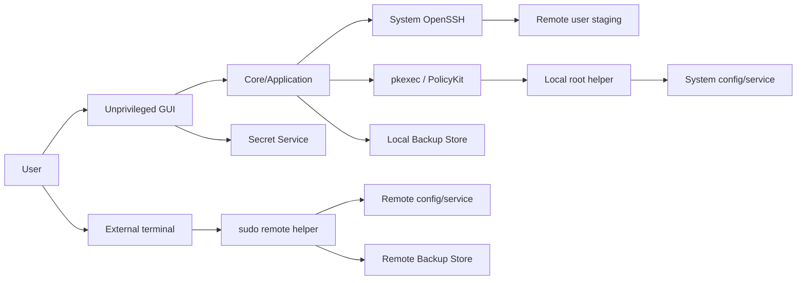

# MVP Threat Model

## 1. 保護対象

- SSH identityとhost selection
- OpenCode/Ollama設定および含まれるsecret reference
- Backup contentと暗号鍵
- 承認済みChangeSet、request、operation journal
- root helperとPolicyKit policy
- audit logの完全性とsecret非露出

## 2. Trust Boundary

GUI/core、SSH先user領域、root helper、Backup Store、Secret Serviceを別trust domainとして扱う。

## 3. 主なThreatと対策

| Threat | 対策 | Residual risk |
|---|---|---|
| host alias/option injection | alias validation、argv実行、`--`相当、resolved host表示 | OpenSSH config自体が悪意ある場合 |
| TOCTOU/symlink attack | openat系safe resolution、nofollow、before hash、owner/mode、rename直前再検証 | filesystem/administrator同時変更 |
| pkexec argument abuse | fixed helper path、dedicated action、helper内schema/allowlist検証 | helper defect |
| malicious staged request | user-only mode、hash、expiry、host/plan binding、root helper再検証 | user account compromise |
| sudo password theft | external terminalへ直接入力、GUI pipe/stdin/logを通さない | compromised terminal/remote host |
| secret leakage | typed redaction、masked diff、raw config非監査、auth denylist | unknown secret-shaped fields |
| backup disclosure | general build encryption ON、local/remote独立鍵、0600/0700、remote root-only | encryption OFF選択、root/desktop session compromise |
| backup corruption | content/manifest hash、local+remote copy、restore前verify | both copies lost/host compromise |
| replay/double apply | request expiry、operation ID、ChangeSet hash、journal terminal state | clock skew; monotonic local checks併用 |
| SSH disconnect | remote journal、before/after hash reconciliation | connection loss during non-atomic service action |
| untrusted schema/version | bundled reviewed snapshot、unknown version read-only | upstream behavior without schema change |
| network exposure | non-loopback Ollama bindとexternal provider baseURLをMVP denylist | 手動構成のriskは利用者管理 |

## 4. Helper Boundary

- debでroot-owned固定pathへinstallし、一般ユーザーが置換できない。
- requestはJSON等の宣言データであり、shell、任意argv、environment injectionを含めない。
- operation enumは`backup_file`, `atomic_replace`, `remove_created_file`, `daemon_reload`, `restart_unit`, `restore_file`, `write_journal`に限定する。
- targetは正規化後allowlist rootと完全一致patternを検証する。
- helperはUI翻訳文字列を判断に使わず、protocol versionとstable enumを使う。

## 5. Backup暗号化

一般配布は暗号化ON、開発モードはOFF。local copy用master keyはSecret Service default collectionへ属性検索可能なitemとして保存する。remote copy用master keyはremote helperが生成し、`/var/lib/llm-manager/keys/backup.key`へroot-onlyで保存する。manifestにはkey ID/scopeだけを記録する。localとremoteで同じkeyを共有しない。

Secret Service collectionがlockedならOS promptへ委譲する。利用不能な一般配布環境では暗号化をsilentにOFFへせず、Backup/Applyを停止してユーザーに選択を求める。remote key欠落時はremote copyを復元不能と表示するが、local key/copyが有効ならlocalから復元できる。local PC喪失時はremote helperとremote keyでremote copyを単独復元できる。

暗号はPython `cryptography`のAES-256-GCMを使用する。copy scopeごとに256-bit master keyを持ち、itemごとに12-byte random nonceと128-bit tagを使いnonceを再利用しない。AADへ`envelope_version`, `backup_id`, `host_fingerprint`, `target_id`を、UTF-8・key順固定・余分な空白なしのcanonical JSONで符号化して束縛する。envelopeはmagic、version、algorithm ID、key ID、nonce、ciphertext/tagだけを持ち、独自暗号primitiveを設計しない。復号後は元content hashも検証する。MVP item上限は16 MiBとする。

## 6. 保存場所

- local backup: `$XDG_DATA_HOME/llm-manager/backups/`、0700 directory、0600 files。
- local journal/audit: `$XDG_STATE_HOME/llm-manager/`。cacheへbackupを置かない。
- remote user copy: `$XDG_DATA_HOME/llm-manager/backups/`相当。
- remote root copy: `/var/lib/llm-manager/backups/`、root-only。
- remote recovery key: `/var/lib/llm-manager/keys/backup.key`、root:root、0600。backup directoryとは分離する。
- transient request: `$XDG_RUNTIME_DIR/llm-manager/`またはremote user-only staging。永続backupと分離する。

XDG environmentが相対pathなら無効としてdefaultへ戻す。remote root pathはdeb/helper導入時に作成する。

## 7. Security Test Gate

- symlink/path traversal、world-writable staging、owner mismatch
- expired/replayed/tampered request、unknown operation
- secret corpusを使ったlog/diff/UI redaction
- Secret Service locked/unavailable/cancelled
- encryption OFF warningと承認失効
- local/remote backup片側失敗
- SSH切断、journal破損、hashがbefore/afterどちらでもない状態
- PolicyKit cancel/deny、terminal sudo cancel/wrong password
- local key喪失、remote key喪失、local PC喪失、copy/key scope取り違え
