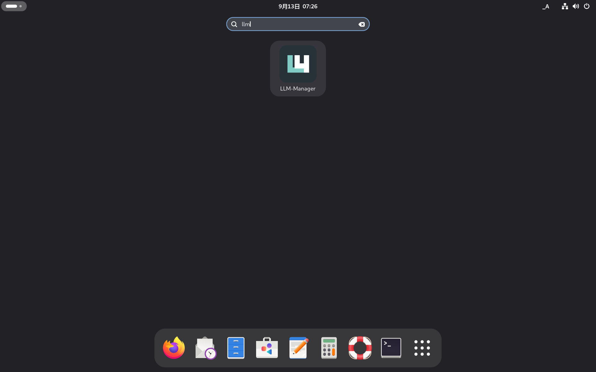
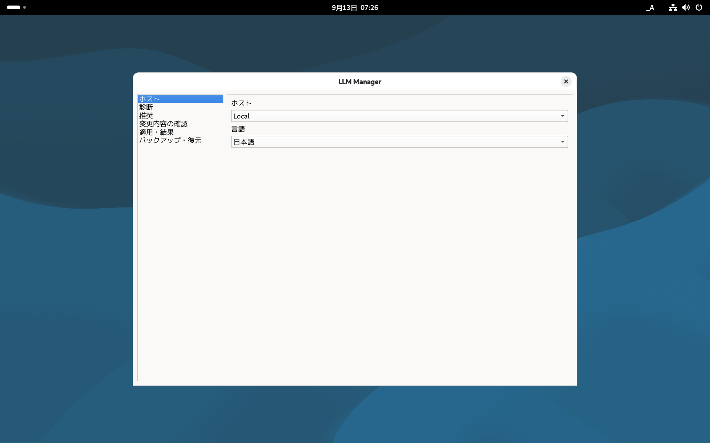

# Phase 6 ff7913b Debian desktop menu — 2026-09-13

ff7913b由来local candidateをDebian 13の通常GNOME Wayland sessionへ一時導入し、desktop menuから
起動した。artifact SHA-256は
`351edec886ff06f7e72979e7e6022abac45354871dbd412cab724d01f9518243`。

## 結果

- GNOME overviewをSuperキーで開き、`llm`を検索した。
- 検索結果に製品iconと`LLM-Manager`が表示された。
- Enterで通常menu起動し、日本語Hosts画面を目視確認した。
- 起動processは1件、UID 1000、argv `/usr/bin/python3 -I /usr/bin/llm-manager`。
- Alt+F4後に対象process不在（pgrep exit 1）を確認した。

## 導入と復元

開始時のAPT simulationからcandidate＋新規依存11件の追加集合を実行時に固定し、既存packageとの
非交差、削除0件を確認してから導入した。`dpkg -V llm-manager`は空、導入後も保全pathは不変。

VMはpflash NVRAM形式のためsnapshotを使っていない。`autoremove`を使わず固定12件だけを
明示purgeし、転送debを削除した。終了時のpackage/manual/保全pathはbaselineと完全一致、
`dpkg --audit`は空、`apt-get check`成功。VMはrunning、session 2は前後とも
Wayland/active/unlockedで完全一致した。

script、APT log/inventory、process、画像、cleanup、SHA256SUMSは
`debian-menu-ff7913b-2026-09-13/`に保存した。画像は1920×1200 RGB PNGとして再確認し、
外側manifestは全件一致した。

これはUNRELEASED candidateのmenu再検査である。Orca音声聴取、別マシン間SSH切断、
UNRELEASED解除後の最終artifact反復は別Gateとして残す。
