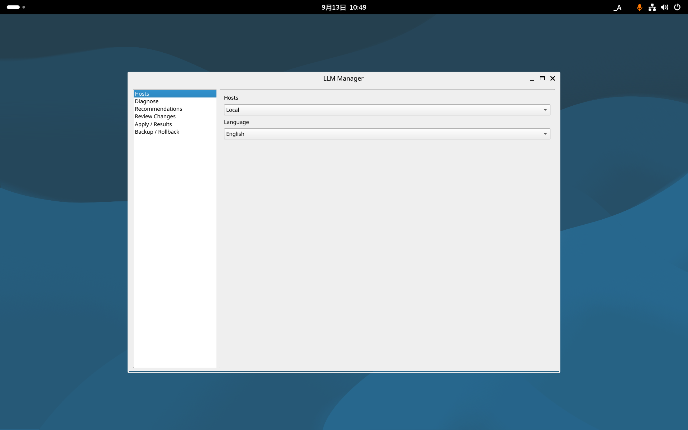

# Phase 6 ff7913b Debian Orca音声capture — 2026-09-13

ff7913b由来local candidateをDebian 13の通常GNOME Wayland sessionへ一時導入し、Orcaと
Speech Dispatcherによる英語UIの読み上げをPipeWire sink monitorからWAVへcaptureした。
artifact SHA-256は
`351edec886ff06f7e72979e7e6022abac45354871dbd412cab724d01f9518243`。

## 結果

OrcaはUID1000、一時prefs directory、`DISPLAY=:0`、`WAYLAND_DISPLAY=wayland-0`で起動した。
製品windowを開いてTabでfocusを移動し、Alt+F4でexit 0となった。Orca debugの発話eventは12件で、
次を含む。

- `Screen reader on.`
- `LLM Manager frame`
- `LLM Manager List with 6 items`
- `Hosts.`
- `Hosts Local combo box Local.`

音声は`debian-orca-ff7913b-2026-09-13/orca-llm-manager.wav`に保存した。20.672秒、48 kHz、
16-bit stereo、3,969,068 bytes、SHA-256
`8ff78014226da10dad843373c87e23f7107334b38295ca59b12278153e8077de`。peak 32768、RMS 5032.38で
非無音判定に成功した。全文のOrca debug、抽出発話JSON、audio metrics、起動画面も同directoryに
保存した。

## 分離とcleanup

既存Orca user設定はなかったため、通常user homeへ設定を作らず`/tmp`の一時prefs/configを使った。
開始前のGNOME `toolkit-accessibility`はfalseで、Orca/recorder終了後にfalseへ明示復元した。
debug logにpassword、token、secret、home path等の該当文字列がないことをhostで確認した。

APT simulationでcandidate＋新規依存11件を固定し、終了時は`autoremove`を使わず12件だけを
明示purgeした。package/manual/保全pathはbaselineと完全一致、session 2は前後とも
Wayland/active/unlocked、`dpkg --audit`は空、`apt-get check`成功、VMはrunning。
一時prefs、guest WAV/debug、転送debも削除した。外側SHA256SUMSは全件一致。

機械検査としては、Orcaが製品名・control用途・値をSpeech Dispatcherへ渡し、実音声波形が出力
されたことまで確認した。人が音声を聴いて発音・順序・聞き取りやすさを判断する試験は代替せず、
保存WAVの利用者確認待ちとする。最終artifactでの反復も別Gateとして残す。
